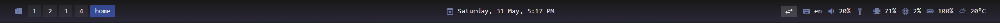

# Glazewm & Zebar
<br>
My modified <b>with-glazewm</b> theme of Glazewm and Zebar tiling for Windows.

<br>


```
const providers = zebar.createProviderGroup({
network: { type: 'network' },
glazewm: { type: 'glazewm' },
cpu: { type: 'cpu' },
date: { type: 'date', formatting: 'EEEE, d MMM, t' },
battery: { type: 'battery' },
memory: { type: 'memory' },
weather: { type: 'weather' },
keyboard: { type: 'keyboard' },
audio: { type: 'audio' },
});
```
<br>

Source: [Glazewm](https://github.com/glzr-io/glazewm), [Zebar](https://github.com/glzr-io/zebar)