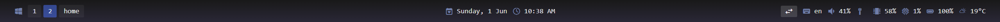

# Glazewm & Zebar
## with-glazewm

My modified <b>with-glazewm</b> theme of Glazewm and Zebar tiling for Windows.


<br>

```
const providers = zebar.createProviderGroup({
network: { type: 'network' },
glazewm: { type: 'glazewm' },
cpu: { type: 'cpu' },
date: { type: 'date', formatting: 'EEEE, d MMM' },
time: { type: 'date', formatting: 't' },
battery: { type: 'battery' },
memory: { type: 'memory' },
weather: { type: 'weather' },
keyboard: { type: 'keyboard' },
audio: { type: 'audio' },
});
```
<br>

Source: [Glazewm](https://github.com/glzr-io/glazewm), [Zebar](https://github.com/glzr-io/zebar)

## Updates

v1.0
* Audio volume added
* Keyboard language added with output correction
* Date modification
* Last desktop (9) named "Home"
* Removed binded Alt+up / Alt+down by reason of coding conflict
<br>

v.1.1
* Time provider added (Date splitted)  

## Bugs
* Muted volume still have number (no output muted exist)
* Empty desktop doesn't dissapear sometimes 